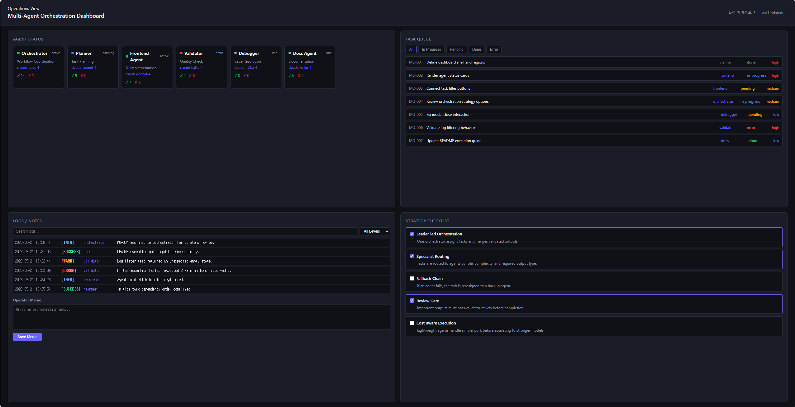

# Multi-Agent Orchestration Dashboard

여러 AI 에이전트의 작업 상태, 실행 로그, 전략 옵션, 운영 메모를 한 화면에서 확인하는 순수 **HTML + CSS + JavaScript** 기반 대시보드 과제입니다. 별도의 프레임워크나 빌드 도구 없이 브라우저에서 바로 실행할 수 있습니다.

## 구현 목표

이 프로젝트의 목표는 멀티 에이전트 시스템을 관제하는 운영 대시보드를 직접 구현하는 것입니다. 각 에이전트가 어떤 역할을 맡고 있는지, 어떤 태스크가 진행 중인지, 최근 로그에 어떤 이슈가 있는지 빠르게 파악할 수 있어야 합니다.

## 주요 기능

- 에이전트 카드: 이름, 역할, 사용 모델, 현재 상태, 성공/실패 횟수 표시
- 태스크 보드: 전체/진행 중/대기/완료/오류 상태 필터링
- 로그 패널: 키워드 검색과 로그 레벨 필터 제공
- 운영 메모: 브라우저 localStorage를 이용한 메모 저장
- 전략 체크리스트: 라우팅, 폴백, 리뷰, 비용 제어 등 운영 전략 토글
- 요약 지표: 전체 에이전트 수, 활성 에이전트 수, 오류 상태, 완료/진행 태스크 수
- 상세 모달: 에이전트 클릭 시 담당 태스크와 관련 로그 확인

## 화면 캡처



## 파일 구조

```text
dashboard/
  index.html     - 화면 구조와 섹션 배치
  style.css      - 다크 테마, 그리드, 카드/리스트/모달 스타일
  app.js         - 렌더링, 필터링, 모달, 메모 저장 로직
  mock-data.js   - 에이전트, 태스크, 로그, 전략 더미 데이터
```

## 실행 방법

### 방법 1. 브라우저에서 직접 실행

`dashboard/index.html` 파일을 더블 클릭해서 엽니다.

### 방법 2. 로컬 서버로 실행

```bash
cd multi-agent-orchestration-dashboard
python3 -m http.server 8000
```

브라우저에서 아래 주소로 접속합니다.

```text
http://localhost:8000/dashboard/
```

## 확인 포인트

- 에이전트 카드 클릭 시 상세 모달이 열리는지 확인합니다.
- 태스크 필터 버튼을 누르면 목록이 상태별로 바뀌어야 합니다.
- 로그 검색어와 레벨 필터가 동시에 적용되어야 합니다.
- 메모 저장 후 새로고침해도 입력값이 유지되어야 합니다.
- 화면 폭이 좁아졌을 때 한 줄 레이아웃으로 자연스럽게 변경되어야 합니다.

## 제약 조건

- 외부 라이브러리를 사용하지 않습니다.
- HTML, CSS, JavaScript만 사용합니다.
- mock 데이터는 `dashboard/mock-data.js`에서 관리합니다.
- UI 문구와 데이터는 자유롭게 변경할 수 있지만 주제는 **Multi-Agent Orchestration Dashboard**로 유지합니다.
